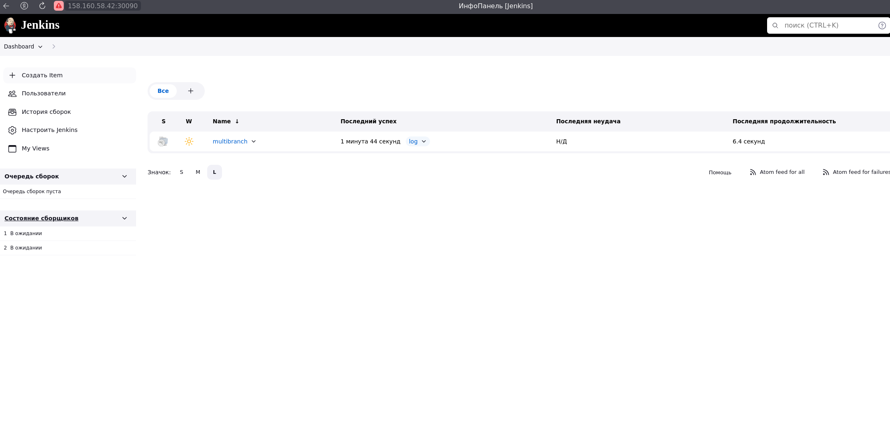

## Дипломный практикум в Yandex.Cloud


###### Листинг файлов
```
├── jenkins                 ##[Файлы для деплоя Jenkins]
│   ├── jenkins-env.yaml        [Переменные окружения]
│   ├── jenkins_sa.yml          [SA для Jenkins]
│   └── jenkins.yml             [Jenkins]

├── jenkins _pre            ##[Файлы для создания образа Jenkins]
│   ├── Dockerfile              [Dockerfile]
│   ├── config                 
│   │   └── casc.yaml            [Файл конфигурации Jenkins]
│   └── my_jobs                  
│       └──  mytask
│           └── config.xml       [подготовленный multibranch]

├── myapp                   ##[Файлы связанные с публикуемым приложением]
│   ├── Dockerfile              [Dockerfile]
│   ├── Jenkinsfile             [Jenkinsfile для размещение в репозитории]
│   ├── myapp-chart             [Директория чарта приложения для helm]
│   │   ├── Chart.yaml            [Чарт]
│   │   ├── templates             [Шаблоны]
│   │   │   ├── app-svc.yml           [Сервис]
│   │   │   └── app.yml               [Приложение]
│   │   └── values.yaml         [Параметры]
│   └── page                  [Файлы используемые nginx в приложении]
│       ├── index.html
│       └── smile.png

├── kuberspray [Kuberspray]

└── tf                    ##[Terraform]
    ├── backend.tf              [Создание бекэнда]
    ├── jenkins.tf              [Деплой Jenkins через kubectl]
    ├── k_inventory.tf          [Генерация inventory для kuberspray]
    ├── kuberspray.tf           [Установка параметра для локальной копии конфига кластера]
                                [Запуск ansible для утсановки кластера]
                                [Копирование конфига в $HOME/.kube/config с нужным IP адресом]
    ├── monitor.tf              [Установка kube-prometheus-stack через helm в namespace monitoring]
    ├── myapp.tf                [Установка приложения через helm]
    ├── net.tf                  [Создание сети и подсетей]
    ├── provider.tf             [Описание провайдера]
    ├── vars.tf                 [Файл используемых переменных]
    └── vms.tf                  [Создание ВМ]
```
---
### - Цели:
    - Этапы выполнения:
    - Создание облачной инфраструктуры
    - Создание Kubernetes кластера
    - Создание тестового приложения
    - Подготовка cистемы мониторинга и деплой приложения
    - Установка и настройка CI/CD

---

Для решения поставленных задач было использовано:
- terraform
- helm
- Docker
- Репозиторий с приложением: https://github.com/Bambrino/myapp
- Образ Jenkins: https://hub.docker.com/repository/docker/bambrino/jenkins/general [bambrino/jenkins:v1.0]

#####Предварительно были подготовлены образы для приложения:

1) Ссылка на образ https://hub.docker.com/repository/docker/bambrino/myapp/general [bambrino/myapp:latest]
[Файлы](./myapp/)

```Dockerfile
FROM nginx:latest

ENV TZ=Europe/Moscow

ADD page /usr/share/nginx/html

EXPOSE 80
```

2) Собран образ jenkins с нужными конфигом, плагинами и multibranch задачей
[Файлы](./Jenkins_pre/)

Ссылка на образ https://hub.docker.com/repository/docker/bambrino/jenkins/general


##### Подготволен код для terraform


###### Запускаем terraform plan


```shell
$ terraform plan

Terraform used the selected providers to generate the following execution plan. Resource actions are indicated with the following symbols:
  + create

Terraform will perform the following actions:

  # local_file.bcConfFile will be created
  + resource "local_file" "bcConfFile" {

...........
...........

  # yandex_vpc_subnet.mysubnet03 will be created
  + resource "yandex_vpc_subnet" "mysubnet03" {
      + created_at     = (known after apply)
      + folder_id      = (known after apply)
      + id             = (known after apply)
      + labels         = (known after apply)
      + name           = "stage-subnet03"
      + network_id     = (known after apply)
      + v4_cidr_blocks = [
          + "192.168.103.0/24",
        ]
      + v6_cidr_blocks = (known after apply)
      + zone           = "ru-central1-c"
    }

Plan: 22 to add, 0 to change, 0 to destroy.

────────────────────────────────────────────────────────────────────────────────────────────────────────────────────────────────────────────────────────────────────────────────────────────────────────────────────────────────────────────────────────────

Note: You didn't use the -out option to save this plan, so Terraform can't guarantee to take exactly these actions if you run "terraform apply" now.
```

###### Ошибок нет, запускаем:

```shell
$ terraform apply --auto-approve
```
..........
```shell
null_resource.jenkins (local-exec): clusterrole.rbac.authorization.k8s.io/jenkins-admin created
null_resource.jenkins (local-exec): serviceaccount/jenkins-admin created
null_resource.jenkins (local-exec): clusterrolebinding.rbac.authorization.k8s.io/jenkins-admin created
null_resource.jenkins: Creation complete after 12s [id=5621991147810378388]

Apply complete! Resources: 22 added, 0 changed, 0 destroyed.
```

###### Terraform выполнил код. Проверяем локальный конфиг  ~/.kube/config

```shell
$ cat ~/.kube/config
apiVersion: v1
clusters:
- cluster:
    certificate-authority-data: 
    ........

    server: https://158.160.58.42:6443
  name: cluster.local
contexts:
- context:
    cluster: cluster.local
    user: kubernetes-admin-cluster.local
  name: kubernetes-admin-cluster.local@cluster.local
current-context: kubernetes-admin-cluster.local@cluster.local
kind: Config
preferences: {}
users:
- name: kubernetes-admin-cluster.local
  user:
    client-certificate-data: 
    ........

    client-key-data: .
    .........
```

###### Проверяем наличие доступа с локальной машины к нашему кластеру в Yandex Cloud:

```shell
$ kubectl get nodes -o wide
NAME       STATUS   ROLES           AGE     VERSION   INTERNAL-IP      EXTERNAL-IP   OS-IMAGE             KERNEL-VERSION      CONTAINER-RUNTIME
master01   Ready    control-plane   7m32s   v1.27.5   192.168.101.20   <none>        Ubuntu 20.04.6 LTS   5.4.0-153-generic   containerd://1.7.5
node01     Ready    <none>          6m21s   v1.27.5   192.168.101.19   <none>        Ubuntu 20.04.6 LTS   5.4.0-153-generic   containerd://1.7.5
node02     Ready    <none>          6m21s   v1.27.5   192.168.102.12   <none>        Ubuntu 20.04.6 LTS   5.4.0-153-generic   containerd://1.7.5
node03     Ready    <none>          6m23s   v1.27.5   192.168.103.25   <none>        Ubuntu 20.04.6 LTS   5.4.0-153-generic   containerd://1.7.5
```


```shell
$ kubectl get pods --all-namespaces
NAMESPACE     NAME                                                     READY   STATUS    RESTARTS   AGE
jenkins       jenkins-6cc956d9bb-kmkcj                                 1/2     Running   0          2m30s
kube-system   calico-kube-controllers-5c5b57ffb5-pftnd                 1/1     Running   0          5m40s
kube-system   calico-node-lck8l                                        1/1     Running   0          6m46s
kube-system   calico-node-mlbww                                        1/1     Running   0          6m46s
kube-system   calico-node-tzsgl                                        1/1     Running   0          6m46s
kube-system   calico-node-zn6d4                                        1/1     Running   0          6m46s
kube-system   coredns-5c469774b8-2b6zk                                 1/1     Running   0          5m6s
kube-system   coredns-5c469774b8-hsc7d                                 1/1     Running   0          5m15s
kube-system   dns-autoscaler-f455cf558-z262r                           1/1     Running   0          5m9s
kube-system   kube-apiserver-master01                                  1/1     Running   1          8m42s
kube-system   kube-controller-manager-master01                         1/1     Running   2          8m46s
kube-system   kube-proxy-9g6kt                                         1/1     Running   0          7m33s
kube-system   kube-proxy-hgqwc                                         1/1     Running   0          7m33s
kube-system   kube-proxy-jjpx7                                         1/1     Running   0          7m33s
kube-system   kube-proxy-rsrwx                                         1/1     Running   0          7m33s
kube-system   kube-scheduler-master01                                  1/1     Running   1          8m42s
kube-system   nginx-proxy-node01                                       1/1     Running   0          7m35s
kube-system   nginx-proxy-node02                                       1/1     Running   0          7m34s
kube-system   nginx-proxy-node03                                       1/1     Running   0          7m34s
kube-system   nodelocaldns-fr79c                                       1/1     Running   0          5m7s
kube-system   nodelocaldns-gfzpb                                       1/1     Running   0          5m7s
kube-system   nodelocaldns-m29z4                                       1/1     Running   0          5m7s
kube-system   nodelocaldns-vhqgr                                       1/1     Running   0          5m7s
monitoring    alertmanager-stable-kube-prometheus-sta-alertmanager-0   2/2     Running   0          3m1s
monitoring    prometheus-stable-kube-prometheus-sta-prometheus-0       2/2     Running   0          3m
monitoring    stable-grafana-5999445d6c-zn2dn                          3/3     Running   0          3m8s
monitoring    stable-kube-prometheus-sta-operator-6f745454df-727pd     1/1     Running   0          3m8s
monitoring    stable-kube-state-metrics-655644f54f-rr76b               1/1     Running   0          3m8s
monitoring    stable-prometheus-node-exporter-7dqts                    1/1     Running   0          3m8s
monitoring    stable-prometheus-node-exporter-gxgkv                    1/1     Running   0          3m8s
monitoring    stable-prometheus-node-exporter-k8vcx                    1/1     Running   0          3m8s
monitoring    stable-prometheus-node-exporter-nhthq                    1/1     Running   0          3m8s
stage         myapp-myapp-stage-5fd6cfbbff-jx9mn                       1/1     Running   0          2m42s
```
 Видим пространства имен monitoring, jenkins, stage (мониторинг, jenkins, наше приложение, соответственно)

###### Для доступа к Grafana из внешней сети нужно внести изменения:

```shell
$ export EDITOR=nano
$ kubectl edit svc stable-grafana -n monitorin
```


##### Проверяем результаты:

Yandex Cloud:

Dashboard:
  

Сети:


Виртуальные машиниы:


Хранилище с состонием terraform`а:


Мониторинг, наличие данных:


Опубликованное приложение:
 

Интерфейс Jenkins:
 

Jenkins Dashboard:
 

Созданный мультибранч:
 

 


##### Выполнение тестовых заданий:

###### DockerHub до тестов:
 

###### Делаем коммит в наш репозиторий:
 

###### Смотрим, реакцию Jenkins - началась сборка (Jenkins успешно увидел изменения в нашем репозитории)

 

###### По условию теста - создан и размещен образ в DockerHub:
 

###### Деплоя нашего приложение не случилось:


###### Делаем комит с тэгом:

 

###### Jenkins "увидел" наш тэг:
 


###### Выполнил сборку и отправку образа с указанием тэга, а также развернул в нашем кластере обновленное приложение:
 

 

 


###### Смотрим кластер, все на своих местах:

```shell
$ kubectl get pods -n stage
NAME                                READY   STATUS    RESTARTS   AGE
myapp-myapp-stage-845bc9bb7-5cn75   1/1     Running   0          33m

$ kubectl get pods --all-namespaces
NAMESPACE     NAME                                                     READY   STATUS    RESTARTS   AGE
jenkins       jenkins-6cc956d9bb-txpfh                                 2/2     Running   0          52m
kube-system   calico-kube-controllers-5c5b57ffb5-pftnd                 1/1     Running   0          98m
kube-system   calico-node-lck8l                                        1/1     Running   0          99m
kube-system   calico-node-mlbww                                        1/1     Running   0          99m
kube-system   calico-node-tzsgl                                        1/1     Running   0          99m
kube-system   calico-node-zn6d4                                        1/1     Running   0          99m
kube-system   coredns-5c469774b8-2b6zk                                 1/1     Running   0          97m
kube-system   coredns-5c469774b8-hsc7d                                 1/1     Running   0          97m
kube-system   dns-autoscaler-f455cf558-z262r                           1/1     Running   0          97m
kube-system   kube-apiserver-master01                                  1/1     Running   1          101m
kube-system   kube-controller-manager-master01                         1/1     Running   2          101m
kube-system   kube-proxy-9g6kt                                         1/1     Running   0          100m
kube-system   kube-proxy-hgqwc                                         1/1     Running   0          100m
kube-system   kube-proxy-jjpx7                                         1/1     Running   0          100m
kube-system   kube-proxy-rsrwx                                         1/1     Running   0          100m
kube-system   kube-scheduler-master01                                  1/1     Running   1          101m
kube-system   nginx-proxy-node01                                       1/1     Running   0          100m
kube-system   nginx-proxy-node02                                       1/1     Running   0          100m
kube-system   nginx-proxy-node03                                       1/1     Running   0          100m
kube-system   nodelocaldns-fr79c                                       1/1     Running   0          97m
kube-system   nodelocaldns-gfzpb                                       1/1     Running   0          97m
kube-system   nodelocaldns-m29z4                                       1/1     Running   0          97m
kube-system   nodelocaldns-vhqgr                                       1/1     Running   0          97m
monitoring    alertmanager-stable-kube-prometheus-sta-alertmanager-0   2/2     Running   0          95m
monitoring    prometheus-stable-kube-prometheus-sta-prometheus-0       2/2     Running   0          95m
monitoring    stable-grafana-5999445d6c-zn2dn                          3/3     Running   0          95m
monitoring    stable-kube-prometheus-sta-operator-6f745454df-727pd     1/1     Running   0          95m
monitoring    stable-kube-state-metrics-655644f54f-rr76b               1/1     Running   0          95m
monitoring    stable-prometheus-node-exporter-7dqts                    1/1     Running   0          95m
monitoring    stable-prometheus-node-exporter-gxgkv                    1/1     Running   0          95m
monitoring    stable-prometheus-node-exporter-k8vcx                    1/1     Running   0          95m
monitoring    stable-prometheus-node-exporter-nhthq                    1/1     Running   0          95m
stage         myapp-myapp-stage-845bc9bb7-5cn75                        1/1     Running   0          33m
```